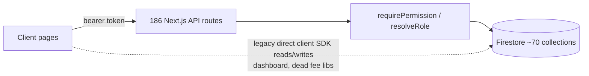

# ERP AUDIT SUMMARY — Sri Narayana High School ERP

Audited 2026-07-20 from source code. Detail in `01`–`15` in this folder; open items in `AUDIT-PROGRESS.md`.

## 1. Current architecture
Next.js 14 App Router monorepo. Client pages (`"use client"`) call 186 REST API routes (`apps/web/app/api/**`) with Firebase bearer tokens; routes use firebase-admin with server-side RBAC (`lib/apiUtils.ts` + `lib/rbacAdmin.ts`). Firestore ~70 collections; real security rules exist. No Cloud Functions, no server actions. Parent portal and teacher portal share the same app under `/portal` and `/teacher`. Sibling Expo mobile and Electron desktop apps exist (unaudited).

## 2. Frontend status
108 pages: ~85 connected to working APIs (structure verified for the critical ones), ~20 connected but unverified per-button, **1 broken** (`/portal/attendance` — permanently empty), duplicated pages: academic-years ×2, reminders ×2. No mock-data pages found.

## 3. Backend status
186 API route files; 0 server actions; ~35 service libs. Server-side auth/permission checks confirmed in all sampled routes (plus a repo lint script for this). Unused/duplicate: `lib/paymentService.ts`, `lib/feeService.ts` (dead client-SDK financial writers), payment logic triplicated across API/fees-confirm/dead lib. Inoperative: `api/cron/*` fee reminders (no scheduler calls them).

## 4. Database status
~70 collections. Orphan-read: `student_attendance` (read by portal, written by nothing). Write-only: 5 audit-log collections (no viewer). Dual-store risk: fee balances live in both `students` and `studentFeeSummaries`. Naming inconsistency snake_case/camelCase. Financial safety: payment recording is transactional with idempotency (**safe**); receipt cancellation, concession recalc, salary-advance deduction, and year-end fee carry-forward are **unverified/unsafe**.

## 5. Complete workflows (UI → DB verified)
Fee collection→receipt (best in app); staff GPS/biometric attendance; leave request→approval→attendance sync; student/teacher/parent/user CRUD; exams→marks→publish→parent view; login/RBAC; timetable CRUD; parent portal fees/payments/exams/notices.

## 6. Most important incomplete workflows
1. **Student daily attendance — does not exist** (breaks parent portal attendance).
2. **Teacher academic workflow (homework authoring, classwork, tasks, principal approval) — does not exist**; teacher portal is HR-only.
3. Fee reminders — full stack built, never triggered (no scheduler/credentials).
4. Payroll — advance deduction and approval lock missing.
5. Year rollover — promotion exists; pending-fee carry-forward not found.
6. Admission — no enquiry stage; fee-assignment linkage unproven.

## 7. Frontend without backend
`/portal/attendance` (effectively — backend reads an unwritten collection).

## 8. Backend without frontend
Audit-log collections (no viewer); `api/cron/*` (no trigger); dead client service libs.

## 9. Top blocking problems (condensed to the real 12)
1. No student attendance module. 2. No teacher academic workflow. 3. Receipt-cancel reversal unverified (financial integrity). 4. Dual fee-balance stores w/ multiple writers. 5. Year-scoping optional on list APIs → cross-year data mixing risk. 6. Fee-reminder system unwired. 7. Salary advance ↔ payroll gap. 8. Year-end fee carry-forward absent. 9. No bulk import (onboarding blocker). 10. Destructive endpoints (erase/reset) need super-admin verification. 11. Dead client-SDK financial write code is a correctness trap. 12. No push/absence/payment notifications to parents.

## 10. Recommended final architecture
Keep the current shape (it is sound): all writes through API routes + admin SDK; retire every client-SDK write; one recalculation service for all fee mutations with `studentFeeSummaries` as the single derived read-model; required `schoolId`+`academicYearId` on every scoped document and enforced defaults on list APIs; external scheduler for cron routes; FCM for notifications; audit-log viewer.

## 11. Exact development order
Phase 0 security/data-safety → auth/year hardening → student master + bulk import → fee/finance hardening → **student attendance (new)** → **teacher workflow (new)** → payroll completion → exams polish → parent notifications → reports/audit viewer → UX/mobile/QA. (Details: `15-production-readiness-plan.md`.)

## 12. Readiness scores (0–100, code-level)
Authentication 80 · User mgmt 80 · Students 75 · Teachers 75 · Staff attendance 80 · **Student attendance 5** · Fees 78 · Finance 60 · Payroll 55 · Exams 65 · Parent portal 70 · Teacher portal 35 · Notifications 25 · Reports 60 · Settings 70 · Security 70 · Performance 60 · Mobile UI 55 (web-responsive; mobile app unaudited).

## 13. Overall verdict: **Partially Functional**
The administrative/financial core (admissions, fees, receipts, staff attendance, payroll skeleton, exams) is genuinely implemented with server-side security and, in the payment path, production-grade transactional care — this is far beyond a prototype. But two entire academic pillars a school uses every single day — student attendance and the teacher classroom workflow — do not exist, several financial reversal paths are unverified, and the reminder/notification layer is unwired. It cannot run a real school yet; with Phases 0–5 completed it plausibly can.
